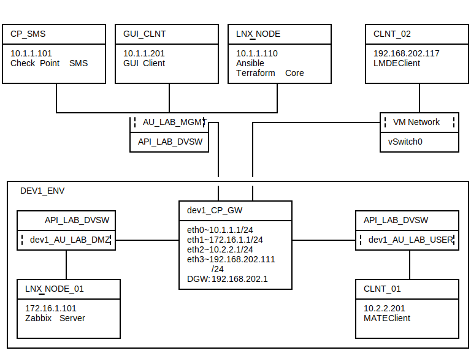

# cp-ansible-pipleline sample~ansible_dev_local
Follwoing is the directory layout of this sample
<pre>
oot/checkpoint/
|---host_vars/                 # variables for inventories host entries
|
|---group_vars/                # variables for inventories group entries
|
|---library/                   # location of additional modules
|   |
|   ...check_point_mgmt.py     # <-- 'cpAnsible' library
|
|---roles/                     # user defined roles
|   |
|   ....0_X__Y                 # General roles
|   ....1_X__Y                 # VMware roles
|   ....2_X__Y                 # Check Point roles
|
|---vmware_vars/               # VMware variables needed by roles and playbooks
|
|---checkpoint_vars/           # Check Point variables needed by roles and playbooks
|
|---scripts/                   # scripts to be run on targets
|   |
|   |---gaia/                  # csv files for executing mgmt_cli commands in batch mode are included
|
|---sub_chkp/                  # Check Point playbooks to be called by master playbooks
|
|...dev1_chkp                  # <-- inventory file
|...0-apistatus.yml            # <-- sample playbook to test chkp mgmt api status
|...1__dev1_create_api.yml     # <-- master playbook to deploy the gw engaging remote api calls for 
|                                    security policy provisioning
|...1__dev1_create_bash.yml    # <-- master playbook to deploy the gw engaging local api calls on the
|                                    security management server using 'mgmt_cli'
|...2__dev1_revert_clean.yml   # <-- master playbook to decommission the gw engaging local api calls 
                                     on the security management server using 'mgmt_cli'
</pre>

and here is a partial HLD of the corresponding environment.

For more information regarding the sample project builder, refer to `2_cpap_sample_builder.sh -i`
